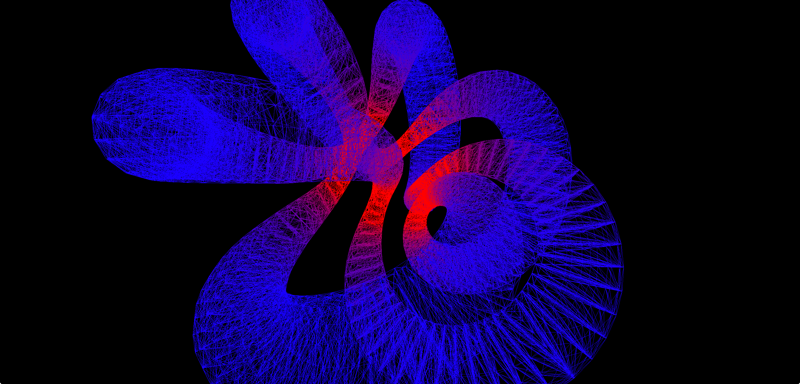

# Lab 3



## Description

In this lab, you will use the finite element method to solve PDEs in N dimensions.

[//]: # (Need to be more specific about the types of problems and finite element formulations)

## Instructions

Implement the missing code in [`src/fem/fem.h`](src/fem/fem.h) marked by `/* Your code here */`.

## Visualizer

###2D

* panning: `w` + mouse movement
* scaling: `r` + mouse movement
* exiting: `esc` or normal exiting methods (ctrl c, close button, command q, or whatever)

###3D
* panning: `w` + mouse movement
* arc ball rotation: `e` + mouse movement
* fov zooming: `f` + vertical mouse movement
* exiting: `esc` or normal exiting methods (ctrl c, close button, command q, or whatever)

## Requirements
* git (I'm using 2.6.4)
* python (I'm using 2.7.10, but 3 should work too)
* cmake (3.2+)


## OS X Usage

Fill in `[problem dim]` with either `1`, `2`, or `3` to solve and visualize a PDE of the
corresponding dimension. If none is specified `3` is used by default.

#### Clone
This repo uses git submodules, so you'll need to recursively clone them.
```shell
git clone -b lab3 --recursive https://github.com/djjh/fem-labs.git
```

#### Configure
```shell
cd fem-labs
./configure.sh
```

#### Build
```shell
cd fem-labs
./build.sh
```

#### Run
Runs the build step automagically.
```shell
cd fem-labs
./run.sh [problem dim]
```

#### Clean
After super cleaning, you'll need to run the configure step again beforing building.
```shell
cd fem-labs
./super_clean.sh
```


## Windows Usage

Fill in `<YEAR>` with either `2010` or `2015`. If you want another visual studio version, just look in the bat files and you'll figure it out; it'll just require switching out a couple of strings.

Fill in `<problem dim>` with either `1`, `2`, or `3` to solve and visualize a PDE of the
corresponding dimension. If none is specified `3` is used by default.

#### Clone
This repo uses git submodules, so you'll need to recursively clone them.
```shell
git clone -b lab3 --recursive https://github.com/djjh/fem-labs.git
```

#### Configure
```shell
cd fem-labs
configure_vs<YEAR>.bat
```

#### Build
```shell
cd fem-labs
build_vs<YEAR>.bat
```

#### Run
Runs the build step automagically.
```shell
cd fem-labs
run_vs<YEAR>.bat [problem dim]
```

#### Clean
After super cleaning, you'll need to run the configure step again beforing building.
```shell
cd fem-labs
super_clean_vs<YEAR>.bat
```

## Linux Usage
In theory should be the same as OS X, however I haven't yet tested it. I'm guessing that it won't work out of the box.
