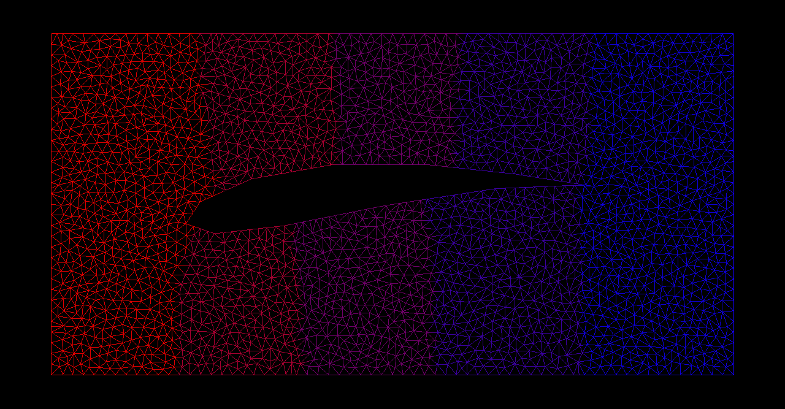

# Lab 2



## Description

In this lab, you will write an implemention of the finite element method for solving the Laplace equation in 2D.

Most of the boilerplate code for setting up the problem and visualizing the solution has been handled for you. You will only need to implement the missing code in [`src/fem/fem2D.h`](src/fem/fem2D.h) that has been clearly marked with `/* Your code here */`. Be sure to look for comments that give additional instructions and hints around these sections.

The program's entry point, [`src/bin/arc.cpp`](src/bin/arc.cpp), instantiates an example boundary problem, defined in [`src/adhoc/airfoil.h`](src/adhoc/airfoil.h). The given example problem solves for the potential velocity around the cross-section of an airplane wing in 2D, as can be found in chapter 4 of Larson & Bengzon. To check your work, you can visually compare the textbook's solution or the above image with you own. I can also provide some numbers to check if anyone is interested.

Running the application will launch a viewer for visualizing your solution. Visualizer controls are:
* panning: `w` + mouse movement
* arc ball rotation: `e` + mouse movement
* fov zooming: `f` + vertical mouse movement
* exiting: `esc` or normal exiting methods (ctrl c, close button, command q, or whatever)


## Requirements
* git (I'm using 2.6.4)
* python (I'm using 2.7.10, but 3 should work too)
* cmake (3.2+)


## OS X Usage

#### Clone
This repo uses git submodules, so you'll need to recursively clone them.
```shell
git clone -b lab2 --recursive https://github.com/djjh/fem-labs.git
```

#### Configure
```shell
cd fem-labs
./configure.sh
```

#### Build
```shell
cd fem-labs
./build.sh
```

#### Run
Runs the build step automagically.
```shell
cd fem-labs
./run.sh
```

#### Clean
After super cleaning, you'll need to run the configure step again beforing building.
```shell
cd fem-labs
./super_clean.sh
```


## Windows Usage

Fill in `<YEAR>` with either `2010` or `2015`. If you want another visual studio version, just look in the bat files and you'll figure it out; it'll just require switching out a couple of strings.

#### Clone
This repo uses git submodules, so you'll need to recursively clone them.
```shell
git clone -b lab2 --recursive https://github.com/djjh/fem-labs.git
```

#### Configure
```shell
cd fem-labs
configure_vs<YEAR>.bat
```

#### Build
```shell
cd fem-labs
build_vs<YEAR>.bat
```

#### Run
Runs the build step automagically.
```shell
cd fem-labs
run_vs<YEAR>.bat
```

#### Clean
After super cleaning, you'll need to run the configure step again beforing building.
```shell
cd fem-labs
super_clean_vs<YEAR>.bat
```

## Linux Usage
In theory should be the same as OS X, however I haven't yet tested it. I'm guessing that it won't work out of the box.
